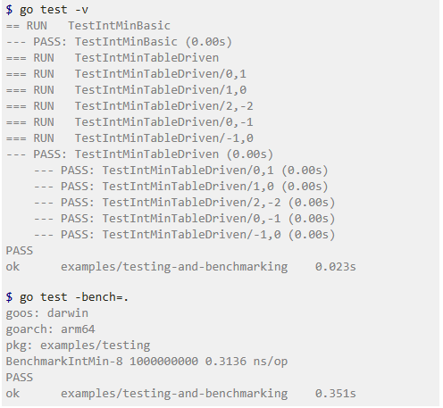
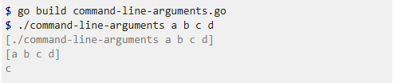
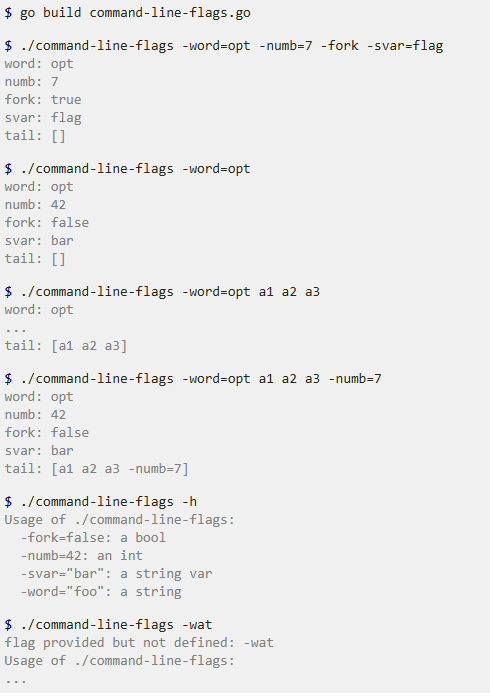
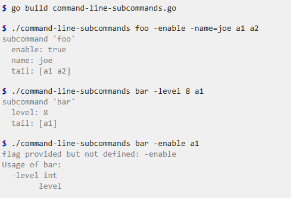
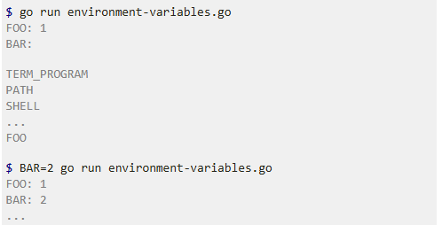

Go by Example
-
- 1：[Hello World](https://gobyexample.com/hello-world)
- 2：[Values](https://gobyexample.com/values)
- 3：[Variables](https://gobyexample.com/variables)
- 4：[Constants](https://gobyexample.com/constants)
- 5：[For](https://gobyexample.com/for)
- 6：[If/Else](https://gobyexample.com/if-else)
- 7：[Switch](https://gobyexample.com/switch)
- 8：[Arrays](https://gobyexample.com/arrays)
- 9：[Slices](https://gobyexample.com/slices)
- 10：[Maps](https://gobyexample.com/maps)
- 11：[Functions](https://gobyexample.com/functions)
- 12：[Multiple Return Values](https://gobyexample.com/multiple-return-values)
- 13：[Variadic Functions](https://gobyexample.com/variadic-functions)
- 14：[Closures](https://gobyexample.com/closures)
- 15：[Recursion](https://gobyexample.com/recursion)
- 16：[Range over Built-in Types](https://gobyexample.com/range-over-built-in-types)
- 17：[Pointers](https://gobyexample.com/pointers)
- 18：[Strings and Runes](https://gobyexample.com/strings-and-runes)
- 19：[Structs](https://gobyexample.com/structs)
- 20：[Methods](https://gobyexample.com/methods)
- 21：[Interfaces](https://gobyexample.com/interfaces)
- 22：[Enums](https://gobyexample.com/enums)
- 23：[Struct Embedding](https://gobyexample.com/struct-embedding)
- 24：[Generics](https://gobyexample.com/generics)
- 25：[Range over Iterators](https://gobyexample.com/range-over-iterators)
- 26：[Errors](https://gobyexample.com/errors)
- 27：[Custom Errors](https://gobyexample.com/custom-errors)
- 28：[Goroutines](https://gobyexample.com/goroutines)
- 29：[Channels](https://gobyexample.com/channels)
- 30：[Channel Buffering](https://gobyexample.com/channel-buffering)
- 31：[Channel Synchronization](https://gobyexample.com/channel-synchronization)
- 32：[Channel Directions](https://gobyexample.com/channel-directions)
- 33：[Select](https://gobyexample.com/select)
- 34：[Timeouts](https://gobyexample.com/timeouts)
- 35：[Non-Blocking Channel Operations](https://gobyexample.com/non-blocking-channel-operations)
- 36：[Closing Channels](https://gobyexample.com/closing-channels)
- 37：[Range over Channels](https://gobyexample.com/range-over-channels)
- 38：[Timers](https://gobyexample.com/timers)
- 39：[Tickers](https://gobyexample.com/tickers)
- 40：[Worker Pools](https://gobyexample.com/worker-pools)
- 41：[WaitGroups](https://gobyexample.com/waitgroups)
- 42：[Rate Limiting](https://gobyexample.com/rate-limiting)
- 43：[Atomic Counters](https://gobyexample.com/atomic-counters)
- 44：[Mutexes](https://gobyexample.com/mutexes)
- 45：[Stateful Goroutines](https://gobyexample.com/stateful-goroutines)
- 46：[Sorting](https://gobyexample.com/sorting)
- 47：[Sorting by Functions](https://gobyexample.com/sorting-by-functions)
- 48：[Panic](https://gobyexample.com/panic)
- 49：[Defer](https://gobyexample.com/defer)
- 50：[Recover](https://gobyexample.com/recover)
- 51：[String Functions](https://gobyexample.com/string-functions)
- 52：[String Formatting](https://gobyexample.com/string-formatting)
- 53：[Text Templates](https://gobyexample.com/text-templates)
- 54：[Regular Expressions](https://gobyexample.com/regular-expressions)
- 55：[JSON](https://gobyexample.com/json)
- 56：[XML](https://gobyexample.com/xml)
- 57：[Time](https://gobyexample.com/time)
- 58：[Epoch](https://gobyexample.com/epoch)
- 59：[Time Formatting / Parsing](https://gobyexample.com/time-formatting-parsing)
- 60：[Random Numbers](https://gobyexample.com/random-numbers)
- 61：[Number Parsing](https://gobyexample.com/number-parsing)
- 62：[URL Parsing](https://gobyexample.com/url-parsing)
- 63：[SHA256 Hashes](https://gobyexample.com/sha256-hashes)
- 64：[Base64 Encoding](https://gobyexample.com/base64-encoding)
- 65：[Reading Files](https://gobyexample.com/reading-files)
- 66：[Writing Files](https://gobyexample.com/writing-files)
- 67：[Line Filters](https://gobyexample.com/line-filters)
- 68：[File Paths](https://gobyexample.com/file-paths)
- 69：[Directories](https://gobyexample.com/directories)
- 70：[Temporary Files and Directories](https://gobyexample.com/temporary-files-and-directories)
- 71：[Embed Directive](https://gobyexample.com/embed-directive)
- 72：[Testing and Benchmarking](https://gobyexample.com/testing-and-benchmarking)
- 
- 73：[Command-Line Arguments](https://gobyexample.com/command-line-arguments)
- 
- 74：[Command-Line Flags](https://gobyexample.com/command-line-flags)
- 
- 75：[Command-Line Subcommands](https://gobyexample.com/command-line-subcommands)
- 
- 76：[Environment Variables](https://gobyexample.com/environment-variables)
- 
- 77：[Logging](https://gobyexample.com/logging)
- 78：[HTTP Client](https://gobyexample.com/http-client)
- 79：[HTTP Server](https://gobyexample.com/http-server)
- 80：[Context](https://gobyexample.com/context)
- 81：[Spawning Processes](https://gobyexample.com/spawning-processes)
- 82：[Exec'ing Processes](https://gobyexample.com/execing-processes)
- 83：[Signals](https://gobyexample.com/signals)
- 84：[Exit](https://gobyexample.com/exit) 


环境配置
- 
[Go 1.13 and above (RECOMMENDED)](https://goproxy.cn/#usage-go-113-and-above-recommended)

Open your terminal and execute

```
$ go env -w GO111MODULE=on
$ go env -w GOPROXY=https://goproxy.cn,direct
```

done.

[macOS or Linux](https://goproxy.cn/#usage-macos-or-linux)

Open your terminal and execute

```
$ export GO111MODULE=on
$ export GOPROXY=https://goproxy.cn
```

or

```
$ echo "export GO111MODULE=on" >> ~/.profile
$ echo "export GOPROXY=https://goproxy.cn" >> ~/.profile
$ source ~/.profile
```

done.

[Windows](https://goproxy.cn/#usage-windows)

Open your terminal and execute

```
C:\> $env:GO111MODULE = "on"
C:\> $env:GOPROXY = "https://goproxy.cn"
```

or

```
1. Open the Start Search, type in "env"
2. Choose the "Edit the system environment variables"
3. Click the "Environment Variables…" button
4. Under the "User variables for <YOUR_USERNAME>" section (the upper half)
5. Click the "New..." button
6. Choose the "Variable name" input bar, type in "GO111MODULE"
7. Choose the "Variable value" input bar, type in "on"
8. Click the "OK" button
9. Click the "New..." button
10. Choose the "Variable name" input bar, type in "GOPROXY"
11. Choose the "Variable value" input bar, type in "https://goproxy.cn"
12. Click the "OK" button
```

done.


在使用 Go 语言进行开发时，设置代理可以加快依赖包的下载速度，尤其是在访问国外资源时。以下是设置 Go 代理的几种方法。

使用命令行设置代理

你可以通过命令行直接设置 Go 代理。例如，将 Go 代理设置为国内的 *https://goproxy.cn*：

go env -w GOPROXY=https://goproxy.cn,direct

设置环境变量

在 Linux 和 macOS 系统中，可以通过设置环境变量来配置 Go 代理：

export GOPROXY=https://goproxy.cn

source ~/.bashrc

在 Windows 系统中，可以使用以下命令：

set GOPROXY=https://goproxy.cn

检查代理是否设置成功

设置完成后，可以通过以下命令查看本机的 Golang 环境变量，重点查看 *GOPROXY* 的值：

go env

输出示例：

set GOPROXY=https://goproxy.cn,direct

通过以上方法，你可以有效地提高 Go 模块下载的速度和成功率


go mod init study

go mod tidy


代理环境配置
-
[Go 1.13 and above (RECOMMENDED)](https://goproxy.cn/#usage-go-113-and-above-recommended)

Open your terminal and execute

```
$ go env -w GO111MODULE=on
$ go env -w GOPROXY=https://goproxy.cn,direct
```

done.

[macOS or Linux](https://goproxy.cn/#usage-macos-or-linux)

Open your terminal and execute

```
$ export GO111MODULE=on
$ export GOPROXY=https://goproxy.cn
```

or

```
$ echo "export GO111MODULE=on" >> ~/.profile
$ echo "export GOPROXY=https://goproxy.cn" >> ~/.profile
$ source ~/.profile
```

done.

[Windows](https://goproxy.cn/#usage-windows)

Open your terminal and execute

```
C:\> $env:GO111MODULE = "on"
C:\> $env:GOPROXY = "https://goproxy.cn"
```

or

```
1. Open the Start Search, type in "env"
2. Choose the "Edit the system environment variables"
3. Click the "Environment Variables…" button
4. Under the "User variables for <YOUR_USERNAME>" section (the upper half)
5. Click the "New..." button
6. Choose the "Variable name" input bar, type in "GO111MODULE"
7. Choose the "Variable value" input bar, type in "on"
8. Click the "OK" button
9. Click the "New..." button
10. Choose the "Variable name" input bar, type in "GOPROXY"
11. Choose the "Variable value" input bar, type in "https://goproxy.cn"
12. Click the "OK" button
```

done.


在使用 Go 语言进行开发时，设置代理可以加快依赖包的下载速度，尤其是在访问国外资源时。以下是设置 Go 代理的几种方法。

使用命令行设置代理

你可以通过命令行直接设置 Go 代理。例如，将 Go 代理设置为国内的 *https://goproxy.cn*：

go env -w GOPROXY=https://goproxy.cn,direct

设置环境变量

在 Linux 和 macOS 系统中，可以通过设置环境变量来配置 Go 代理：

export GOPROXY=https://goproxy.cn

source ~/.bashrc

在 Windows 系统中，可以使用以下命令：

set GOPROXY=https://goproxy.cn

检查代理是否设置成功

设置完成后，可以通过以下命令查看本机的 Golang 环境变量，重点查看 *GOPROXY* 的值：

go env

输出示例：

set GOPROXY=https://goproxy.cn,direct

通过以上方法，你可以有效地提高 Go 模块下载的速度和成功率


go mod init study

go mod tidy

